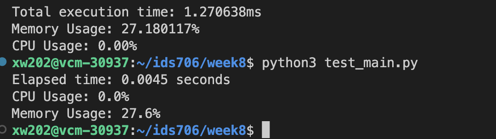

### Week8 Rewrite a Python Script in Rust
In this project, i used my week2 python script reading and calculating some statistic result from nba.csv and rewrote it using Rust. Then i compare the time usage and resource usage for this two language. 

Shown in below, the time for Rust is 0.00127 seconds, python is 0.0045 seconds. The memory usage for Rust is 12.180%, 27.6% for python. Thus, the Rust is faster than python, the memory usage for rust is slightly less than that for python.

## Sample Output

## References

* [rust-cli-template](https://github.com/kbknapp/rust-cli-template)
